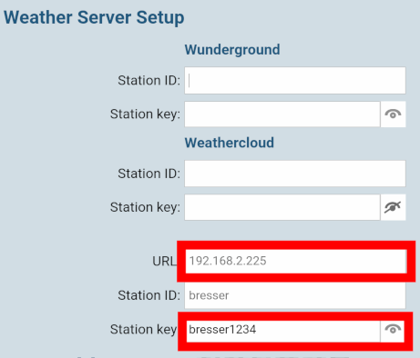

## Fork for Breser weather stations
I created this fork for using the integration with a [Bresser WIFI ClearView 7in1 weather station](https://www.bresser.de/en/Weather-Time/WLAN-Weather-Stations-Centers/BRESSER-WIFI-ClearView-Weather-Center-with-7-in-1-Sensor.html) (art. no. 7002586 / 7902586) which seems to be manufactured by [CCLEL](https://cclel.com/product/c6079a-c3120a/) (art. no. C6079A).

It might also work with other models made by Bresser or CCLEL. The protocol used by CCLEL stations differs a bit from Ecowitt stations.

For using this fork you will also need the forked [python library](https://github.com/ei-ke/pyecowitt/tree/pr-cclel).

More details can be found at https://github.com/garbled1/homeassistant_ecowitt/issues/88 were the author was helping me to hack this stuff together.

## Getting things up and running

1. The CCLEL firmware only able to send data to a custom webserver on port 80. Thus you need redirect this port to the one you configured within the plugin. Default is 4199.

    I've done this on my firewall as I'm crossing subnets anyways. But it should also be possible to achieve this on your Home Assistant instance using iptables or ufw.

2. Start up the weather station in configuration / access point mode to access the webinterface. When you are connected to the weather station you can access it on http://192.168.1.1/

3. In the "Weather Server Setup" section you have to enter the IP address of your Home Assistant instance into the URL field. The "Station ID" is not really relevant, but the "Station key" should be unique for your Home Assistant as this value is used to "identify" each station in case you have more than one connected to your Home Assistant.

    

4. Now you should be receiving measurements on your Home Assistant as soon as you are adding the Ecowitt component.

## Getting help
In case you should need help with this repository please create an issue and I'll try to help as good as I can.

Disclaimer: This fork is just what I was able to create with "trial and error". I don't have any in depth knowledge of the code I tinkered together. So don't be surprised if it breaks somewhere/somehow :)
